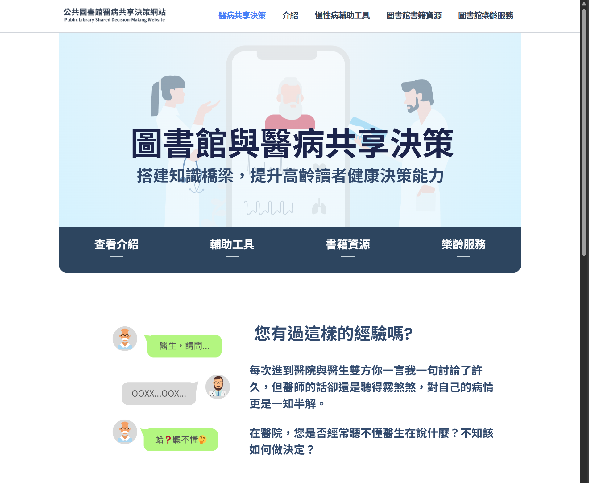

# Public Library Shared Decision-Making Website
This is a simple promotional website for shared decision-making (SDM) between patients and healthcare providers, designed to improve public awareness and understanding of SDM practices in healthcare.

Originally built using WordPress with Elementor, the site was later converted into a static HTML website using Simply Static, as its content became more stable and no longer required CMS functionality.

## Demo
The live demo can be accessed here: https://plsdm.ncculias.com

